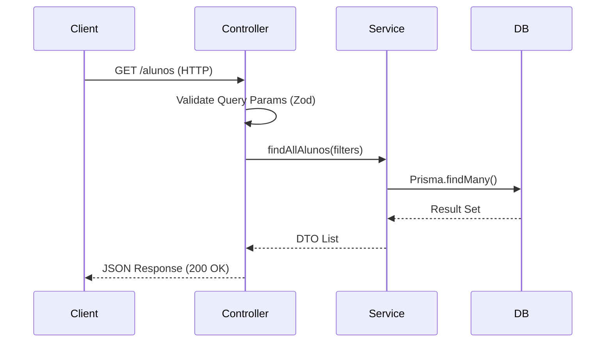

# Interface Contracts & API Reference

**Classificação:** Interface Documentation
**Protocolo:** RESTful over HTTPS
**Formatos:** JSON (application/json)

> [!WARNING]
> Esta documentação é mantida **manualmente**. Em caso de divergência, o código-fonte (`src/routes`, `src/schemas`) é a fonte da verdade.

Este documento define os contratos de interface da Camada de Apresentação (Presentation Layer).

## 1. Padrões de Protocolo (Protocol Standards)

### 1.1 Envelope de Resposta (Response Envelope)
A API implementa um envelope padronizado para garantir consistência de consumo pelo client (Frontend).

**Sucesso (200 OK):**
```json
{
  "data": { ... },       // Payload Principal (Object ou Array)
  "meta": {              // Metadados de Paginação (Opcional)
    "total": 150,
    "page": 1,
    "limit": 20
  }
}
```

**Erro (4xx/5xx):**
```json
{
  "error": "Access Denied",  // Mensagem Amigável (User-Facing)
  "code": "AUTH_001",        // Código de Erro Interno (Opcional)
  "details": "..."           // Stack Trace (Apenas em ambiente DEV)
}
```

### 1.2 Segurança de Transporte
*   **Authentication:** Bearer Token (JWT) via Cookie HttpOnly.
*   **Authorization:** Middleware `verificarToken` valida a sessão antes do Controller.

## 2. Catálogo de Recursos (Resource Catalog)

### 2.1 Módulo: Identidade (`/auth`)

| Método | Endpoint | Middleware | Descrição Técnica |
| :---: | :--- | :--- | :--- |
| `POST` | `/api/auth/google-login` | `RateLimit(Login)` | Exchange de Credencial Google para Sessão interna. |
| `POST` | `/api/auth/logout` | `Auth` | Invalidação de Cookie de Sessão. |

### 2.2 Módulo: Estudantes (`/alunos`)

| Método | Endpoint | Middleware | Descrição Técnica |
| :---: | :--- | :--- | :--- |
| `GET` | `/api/alunos` | `Auth` | Listagem paginada com suporte a filtros dinâmicos via Query Param. |
| `GET` | `/api/alunos/:ra` | `Auth` | Recuperação de entidade por Chave Primária (RA). |
| `GET` | `/api/alunos/stats` | `Auth` | Agregação de dados para Dashboard (OLAP-like queries). |
| `POST` | `/api/alunos` | `Auth, Admin` | Criação de recurso. Exige payload validado por `alunoSchema`. |

### 2.3 Módulo: Instituições (`/escolas`)

| Método | Endpoint | Middleware | Descrição Técnica |
| :---: | :--- | :--- | :--- |
| `GET` | `/api/escolas` | `Auth` | Listagem de referência de unidades escolares. |

## 3. Padrão de Camadas (Layered Pattern)

Seguindo a arquitetura **MSC**, os endpoints delegam imediatamente para a camada de serviço.


