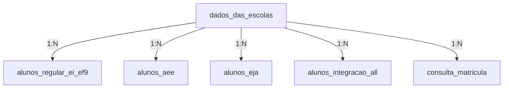
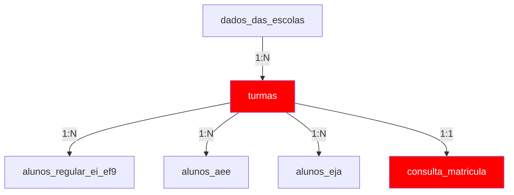

# Análise Profunda de Modelagem de Banco de Dados - SEDUC ON

**Data:** 01/12/2025  
**Objetivo:** Analisar schema atual e propor melhorias estruturais para aproveitar melhor o PostgreSQL

---

## 🔴 PROBLEMAS CRÍTICOS IDENTIFICADOS

### 1. **`relationMode = "prisma"` - SEM FOREIGN KEYS REAIS!**

```prisma
datasource db {
  provider = "postgresql"
  url      = env("DATABASE_URL")
  relationMode = "prisma"  // ⚠️ PROBLEMA!
}
```

**O que isso significa:**
- Prisma emula foreign keys no **APPLICATION LEVEL**
- PostgreSQL **NÃO tem constraints FK reais** no banco
- Sem integridade referencial garantida
- Sem cascata de deletes/updates
- Performance degradada (sem otimizações do PostgreSQL)

**Impacto:**
- ❌ Dados órfãos podem existir (alunos sem escola)
- ❌ Deletes/updates não propagam
- ❌ PostgreSQL não pode otimizar JOINs
- ❌ Sem índices automáticos em FKs

### 2. **Desnormalização Excessiva**

Tabelas de alunos têm **dados duplicados/redundantes**:

```prisma
model alunos_regular_ei_ef9 {
  cod_escola String?      // FK para escola
  nome_escola String?     // ❌ DUPLICADO! Já está em dados_das_escolas
  inep String?            // ❌ DUPLICADO! Já está em dados_das_escolas
  
  cod_turma String?       // ❌ Sem FK! Deveria referenciar tabela de turmas
  turma String?           // ❌ Dados denormalizados
  filtro_serie String?    // ❌ Dados denormalizados
}
```

**Problemas:**
1. **Inconsistência:** Se nome da escola mudar, temos que atualizar N alunos
2. **Espaço:** ~10k alunos × 50 bytes/escola = 500KB desperdiçados
3. **Performance:** Queries duplicam dados desnecessariamente

### 3. **Falta de Tabela de Turmas**

Atualmente:
- `cod_turma`, `turma`, `filtro_serie` estão **espalhados** em múltiplas tabelas
- N problema clássico: dados não normalizados

**Deveria existir:**
```sql
CREATE TABLE turmas (
  id SERIAL PRIMARY KEY,
  cod_turma VARCHAR(20) UNIQUE NOT NULL,
  cod_escola VARCHAR(20) REFERENCES dados_das_escolas(cod_escola),
  nome_turma VARCHAR(100),
  filtro_serie VARCHAR(50),
  periodo VARCHAR(20),
  ano_letivo INT,
  capacidade INT,
  professor_id INT
);
```

### 4. **Chave Primária Errada em `consulta_matricula`**

```prisma
model consulta_matricula {
  id String?           // ❌ String opcional?
  id_new Int @id @default(autoincrement())  // ❌ Autoincrement sem significado
  
  cod_turma String?    // Deveria ser FK + parte de composite key
  cod_escola String?   // Deveria ser FK
}
```

**Problema:** PK artificial sem significado semântico

**Solução:** Composite key ou usar campos naturais

### 5. **Dados de Escola Duplicados em `consulta_matricula`**

```prisma
model consulta_matricula {
  cod_escola String?
  nome_escola String?      // ❌ JÁ está em dados_das_escolas
  tipo_de_ensino String?   // ❌ Redundante
}
```

### 6. **Campos `turma1...turma40` em `dados_das_escolas`**

```prisma
model dados_das_escolas {
  turma1 String?
  turma2 String?
  // ... até turma40
}
```

**❌ ANTI-PADRÃO CLÁSSICO!**

Isso deveria ser uma **tabela separada** com relação 1:N

---

## 📊 ANÁLISE DAS RELAÇÕES ATUAIS

### Relações Definidas no Prisma



### Relações que FALTAM



**Tabelas faltantes:**
- ❌ `turmas` (entidade central!)
- ❌ `series` (para normalizar `filtro_serie`)
- ❌ `professores` (referenciado em `prof1` mas sem tabela)

---

## 🎯 REDESIGN PROPOSTO

### Solução 1: Ativar Foreign Keys Reais

```prisma
datasource db {
  provider = "postgresql"
  url      = env("DATABASE_URL")
  // REMOVER relationMode = "prisma"
  // PostgreSQL nativo com FKs reais
}
```

**Benefícios:**
- ✅ Integridade referencial garantida
- ✅ Cascatas automáticas
- ✅ Índices automáticos em FKs
- ✅ Otimizações do PostgreSQL

### Solução 2: Criar Tabela de Turmas

```prisma
model turmas {
  id              Int     @id @default(autoincrement())
  cod_turma       String  @unique @db.VarChar(20)
  cod_escola      String  @db.VarChar(20)
  nome_turma      String?
  filtro_serie    String?
  ano_letivo      Int
  periodo         String?
  capacidade      Int?
  professor_id    Int?
  
  escola          dados_das_escolas @relation(fields: [cod_escola], references: [cod_escola], onDelete: Restrict)
  alunos_regular  alunos_regular_ei_ef9[]
  alunos_aee      alunos_aee[]
  alunos_eja      alunos_eja[]
  
  @@index([cod_escola])
  @@index([filtro_serie])
  @@map("turmas")
}
```

### Solução 3: Normalizar Tabelas de Alunos

**ANTES:**
```prisma
model alunos_regular_ei_ef9 {
  cod_escola String?
  nome_escola String?  // DUPLICADO
  inep String?         // DUPLICADO
  cod_turma String?    // SEM FK
}
```

**DEPOIS:**
```prisma
model alunos_regular_ei_ef9 {
  cod_escola String  @db.VarChar(20)
  cod_turma String   @db.VarChar(20)
  // REMOVER nome_escola, inep (vem do JOIN)
  
  escola dados_das_escolas @relation(fields: [cod_escola], references: [cod_escola])
  turma turmas @relation(fields: [cod_turma], references: [cod_turma])
  
  @@index([cod_escola])
  @@index([cod_turma])
}
```

### Solução 4: Refatorar `dados_das_escolas`

**ANTES:**
```prisma
model dados_das_escolas {
  turma1 String?
  turma2 String?
  // ... turma40
}
```

**DEPOIS:**
```prisma
model dados_das_escolas {
  cod_escola String @id
  // REMOVER turma1...turma40
  
  turmas turmas[]  // Relação 1:N
}
```

### Solução 5: Normalizar `consulta_matricula`

**ANTES:**
```prisma
model consulta_matricula {
  id String?
  id_new Int @id
  cod_escola String?
  nome_escola String?  // DUPLICADO
  cod_turma String?    // SEM FK
}
```

**DEPOIS:**
```prisma
model consulta_matricula {
  id              Int     @id @default(autoincrement())
  cod_turma       String  @db.VarChar(20)
  capacidade      Int?
  quant_alunos_ativos Int?
  
  turma           turmas  @relation(fields: [cod_turma], references: [cod_turma])
  
  @@unique([cod_turma])  // Uma matrícula por turma
  @@map("consulta_matricula")
}
```

---

## 📋 SCHEMA PROPOSTO COMPLETO

```prisma
generator client {
  provider = "prisma-client-js"
}

datasource db {
  provider = "postgresql"
  url      = env("DATABASE_URL")
  // PostgreSQL nativo - FK reais
}

// 1. ESCOLAS (entidade raiz)
model dados_das_escolas {
  cod_escola         String  @id @db.VarChar(20)
  nome_escola        String
  inep               String?
  endereco           String?
  // ... outros campos
  
  turmas             turmas[]
  alunos_integracao  alunos_integracao_all[]
  alunos_regular     alunos_regular_ei_ef9[]
  alunos_aee         alunos_aee[]
  alunos_eja         alunos_eja[]
  
  @@map("dados_das_escolas")
}

// 2. TURMAS (nova entidade central)
model turmas {
  id                 Int     @id @default(autoincrement())
  cod_turma          String  @unique @db.VarChar(20)
  cod_escola         String  @db.VarChar(20)
  nome_turma         String?
  filtro_serie       String?
  periodo            String? @db.VarChar(20)
  ano_letivo         Int
  capacidade         Int?
  
  escola             dados_das_escolas @relation(fields: [cod_escola], references: [cod_escola], onDelete: Restrict)
  alunos_regular     alunos_regular_ei_ef9[]
  alunos_aee         alunos_aee[]
  alunos_eja         alunos_eja[]
  matricula          consulta_matricula?
  
  @@index([cod_escola])
  @@index([filtro_serie])
  @@index([ano_letivo])
  @@map("turmas")
}

// 3. ALUNOS (normalizados)
model alunos_regular_ei_ef9 {
  id                Int       @id @default(autoincrement())
  ra                String    @unique @db.VarChar(20)
  nome_aluno        String
  cod_escola        String    @db.VarChar(20)
  cod_turma         String    @db.VarChar(20)
  situacao          String    @db.VarChar(10)
  // ... outros campos (SEM nome_escola, SEM inep)
  
  escola            dados_das_escolas @relation(fields: [cod_escola], references: [cod_escola])
  turma             turmas @relation(fields: [cod_turma], references: [cod_turma])
  
  @@index([situacao])
  @@index([cod_escola])
  @@index([cod_turma])
  @@map("alunos_regular_ei_ef9")
}

// 4. MATRÍCULAS (normalizada)
model consulta_matricula {
  id                    Int     @id @default(autoincrement())
  cod_turma             String  @unique @db.VarChar(20)
  capacidade            Int?
  quant_alunos_ativos   Int?
  
  turma                 turmas  @relation(fields: [cod_turma], references: [cod_turma])
  
  @@index([cod_turma])
  @@map("consulta_matricula")
}
```

---

## 🔄 PLANO DE MIGRAÇÃO

### Fase 1: Preparação (SEM MUDANÇAS NO BANCO)
1. ✅ Documentar schema atual
2. ✅ Identificar problemas
3. ✅ Propor redesign
4. ⏩ **VOCÊ ESTÁ AQUI**

### Fase 2: Criar Tabela de Turmas
1. Criar nova tabela `turmas`
2. Popular com dados únicos de `cod_turma` existentes
3. Adicionar foreign keys nas tabelas de alunos

### Fase 3: Normalizar Dados
1. Remover campos duplicados (`nome_escola`, `inep` de alunos)
2. Atualizar queries para usar JOINs

### Fase 4: Ativar Foreign Keys Nativas
1. Remover `relationMode = "prisma"`
2. Criar migration com FKs reais
3. Adicionar índices

---

## ⚠️ ANTES DE PROSSEGUIR

**Decisões a tomar:**

1. **Ativar FKs nativas?**
   - ✅ SIM - PostgreSQL full power
   - ❌ NÃO - Manter emulação Prisma

2. **Criar tabela de turmas?**
   - ✅ SIM - Normalização correta
   - ❌ NÃO - Manter denormalizado

3. **Remover campos duplicados?**
   - ✅ SIM - Normalizar (quebra queries atuais)
   - ❌ NÃO - Manter compatibilidade

4. **Quando implementar?**
   - 🟢 AGORA - Antes de crescer mais
   - 🟡 FUTURO - Após outras otimizações
   - 🔴 NUNCA - Muita complexidade

---

## 💡 RECOMENDAÇÃO

**Abordagem Gradual:**

1. **IMEDIATO:** Criar índices (não quebra nada)
2. **CURTO PRAZO:** Ativar FKs nativas + criar tabela turmas
3. **MÉDIO PRAZO:** Normalizar dados (requer refatoração de queries)

**Benefícios:**
- Melhor integridade de dados
- Performance superior
- Manutenção mais fácil
- Aproveita 100% do PostgreSQL

---

## 📊 COMPARAÇÃO: ANTES vs DEPOIS

| Aspecto | Antes | Depois |
|---------|-------|--------|
| **FK Reais** | ❌ Emuladas (Prisma) | ✅ Nativas (PostgreSQL) |
| **Integridade** | ⚠️ Application-level | ✅ Database-level |
| **Turmas** | ❌ Dados espalhados | ✅ Tabela dedicada |
| **Normalização** | ❌ Muitos duplicados | ✅ Normalizado (3NF) |
| **Performance JOINs** | ⚠️ Sem otimização | ✅ Otimizado pelo PG |
| **Manutenção** | ❌ Complexa | ✅ Simples |

---

**Próximo passo:** Aguardando sua decisão sobre qual caminho seguir 🚀
