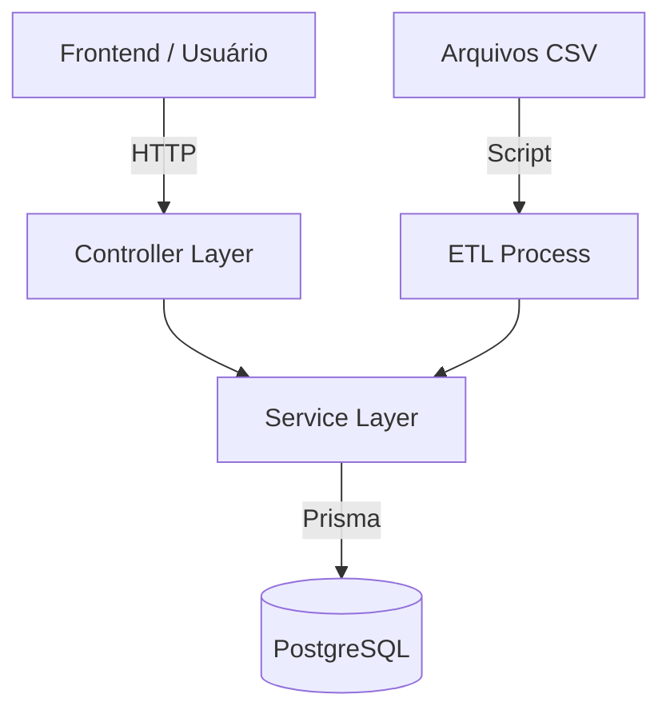

# Visão Geral do Projeto (SEDUC ON)

**Data da Última Atualização:** Dezembro 2025
**Versão:** 1.0 (Estável)

Este documento fornece uma visão técnica e estratégica do backend da plataforma **SEDUC ON**, um sistema de gestão de dados educacionais focado em performance e integridade.

## 🎯 Objetivo
Centralizar, processar e disponibilizar dados educacionais (alunos, escolas, turmas) de forma segura e performática, suportando importações massivas de dados legados (CSV) e operações em tempo real via API.

## 🏗 Arquitetura
O sistema segue o padrão **MSC (Model-Service-Controller)** para garantir o desacoplamento entre a camada de apresentação (API) e as regras de negócio.

### Componentes Principais
1.  **API REST (Express):** Camada de entrada que gerencia rotas, validação básica e autenticação.
2.  **Services (Regras de Negócio):** Núcleo da aplicação. Contém toda a lógica de manipulação de dados, validação de negócio e orquestração.
3.  **Data Access (Prisma ORM):** Abstração do banco de dados PostgreSQL.
4.  **ETL Modular:** Sistema de importação de dados massivos desacoplado, que compartilha validadores com a API.

### Diagrama Simplificado

## 🛠 Stack Tecnológico
*   **Runtime:** Node.js (v20+)
*   **Framework:** Express.js 5.x
*   **Database:** PostgreSQL 15+
*   **ORM:** Prisma 6.x
*   **Segurança:** Google OAuth 2.0, Helmet, Rate Limiting
*   **Testes:** Jest (Unitários), Playwright (E2E)

## 📁 Estrutura de Diretórios
A organização segue o padrão de "Source" (`src`) para isolar o código da aplicação de arquivos de configuração.

*   `backend/src/controllers`: Manipuladores de requisição HTTP (O "Garçom").
*   `backend/src/services`: Lógica de negócio pura (O "Chef").
*   `backend/src/utils`: Ferramentas compartilhadas (ex: `sanitizarTexto`).
*   `backend/src/etl`: Queries e processadores específicos para carga de dados.
*   `backend/prisma`: Schemas do banco e script orquestrador de importação (`import_ALUNOS.js`).

## 🚀 Status Atual
*   **Arquitetura:** ✅ Desacoplada e Modular.
*   **ETL:** ✅ Otimizado (Streaming + Batch Insert) e Validado.
*   **Segurança:** ✅ RBAC e Autenticação Google implementados.
*   **Documentação:** ✅ Completa e em Português (BR).

---
*Para detalhes específicos sobre a importação de dados, consulte a [Documentação Técnica de ETL](./technical/etl.md).*
