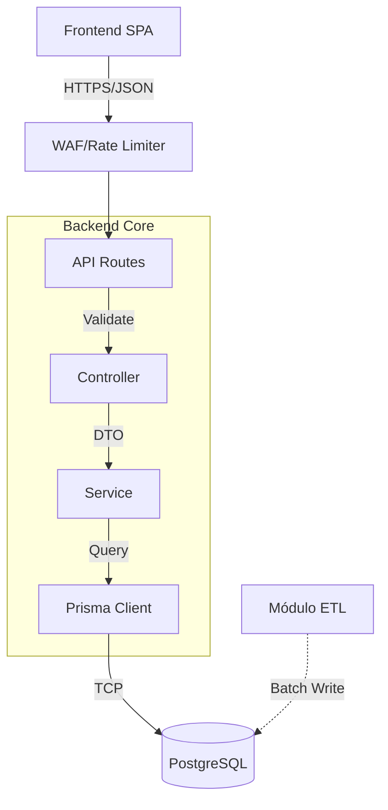

# Visão Geral Técnica (System Overview)

**Classificação:** Documentação de Arquitetura de Alto Nível
**Stack:** Node.js, Express, PostgreSQL, Prisma

## 1. Introdução Estratégica

O **SEDUC ON** é o sistema central de inteligência de dados da Secretaria de Educação. Sua arquitetura foi desenhada para resolver dois desafios antagonistas:
1.  **Ingestão de Dados em Lote (High Throughput):** Processamento robusto de arquivos CSV legados via ETL.
2.  **API de Alta Disponibilidade (Low Latency):** Entrega de dados em tempo real para dashboards.

## 2. Paradigma Arquitetural

O sistema adota estritamente a **Three-Tier Layered Architecture** (Arquitetura em Três Camadas), garantindo separação de interesses (SoC) e testabilidade.

### 2.1 Componentes da Arquitetura

1.  **Presentation Layer (API Gateway / Routes):**
    -   Ponto de entrada RESTful.
    -   Responsável por validação de esquema (Zod), autenticação (JWT/Cookie) e roteamento.
    
2.  **Application Layer (Controllers):**
    -   Orquestração de fluxo.
    -   Conversão de DTOs e gerenciamento de respostas HTTP.

3.  **Domain Layer (Services):**
    -   Regras de negócio puras.
    -   Agnóstico ao protocolo de transporte (HTTP).

4.  **Persistence Layer (Data Access):**
    -   Implementado via **Prisma ORM**.
    -   Atua como Type-Safe Query Builder e Data Mapper.

### 2.2 Diagrama Lógico de Fluxo

## 3. Estrutura de Código (Modular Pattern)

A organização de diretórios reflete a separação lógica das camadas:

*   `src/controllers`: Manipuladores de requisição (Stateless).
*   `src/services`: Unidades lógicas de negócio e acesso a dados.
*   `src/routes`: Definições de endpoints e middlewares.
*   `src/etl`: Pipelines de extração e transformação de dados.
*   `src/schemas`: Contratos de dados (Zod Schemas).

## 4. Status de Conformidade

*   **Arquitetura:** ✅ Estável (Layered).
*   **Segurança:** ✅ Hardened (Defense in Depth).
*   **Performance:** ✅ Otimizada (Streaming ETL).

---
*Para uma análise profunda de segurança e decisões de design, consulte o [Relatório Técnico de Arquitetura](./RELATORIO_SEGURANCA_ARQUITETURA.md).*
