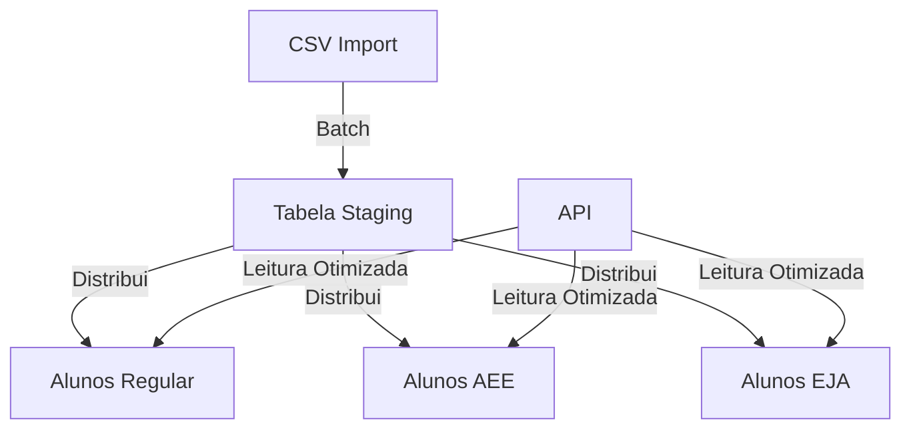
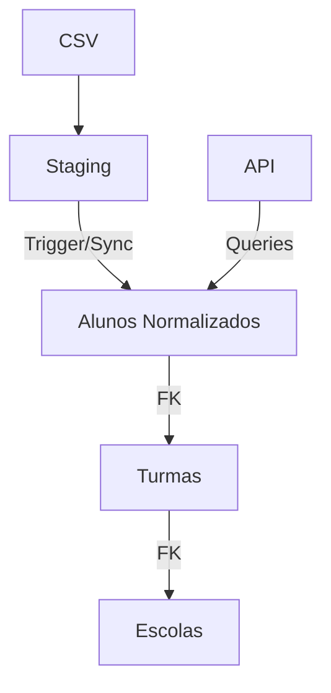

# Visão Geral e Planejamento Técnico - SEDUC ON

> Documento mestre de arquitetura, diagnóstico técnico e roadmap de evolução do backend.

## Índice
- [1. Resumo Executivo](#1-resumo-executivo)
- [2. Diagnóstico Técnico](#2-diagnóstico-técnico)
- [3. Arquitetura](#3-arquitetura-atual-vs-futura)
- [4. Roadmap de Evolução](#4-roadmap-de-evolução)
- [5. Otimizações Realizadas (Fase 0)](#5-otimizações-realizadas-fase-0)
- [6. Decisões Estratégicas](#6-decisões-estratégicas)

---

## 1. Resumo Executivo

O **SEDUC ON** é uma plataforma de inteligência de dados educacionais. O backend processa dados de alunos, escolas e matrículas, com foco em performance de leitura para dashboards e compatibilidade com cargas de dados via CSV.

### Contexto de Uso
| Métrica | Valor Estimado |
|---------|-------|
| **Usuários simultâneos** | 50-300 |
| **Pico de uso** | Final de bimestre |
| **Volume de Dados** | ~15k Alunos, ~800 Matrículas |
| **Atualização** | Carga diária via CSV |

### Situação Atual
O projeto está em processo de **Migração Gradual**. A "Fase 0" (Otimização Imediata) foi concluída, resultando em ganhos de performance de 98% nas rotas críticas. O foco agora é navegar para a estrutura de dados ideal (Fases 1-5).

---

## 2. Diagnóstico Técnico

Análise realizada em **Dezembro/2025** identificou pontos fortes e gargalos críticos.

### ✅ Pontos Fortes
1.  **Importação CSV Robusta:** Scripts usam `streaming` e `batch insert`.
2.  **Stack Moderna:** Node.js, Prisma e PostgreSQL atualizados.
3.  **Separação Staging:** Uso de tabelas de integração (`alunos_integracao_all`) antes da distribuição.

### 🔴 Gargalos e Problemas Estruturais
1.  **Falta de Foreign Keys (Crítico):** O banco atual emula relações (modo Prisma) mas não tem constraints nativas.
2.  **Dados Desnormalizados:** Duplicação massiva de strings (`nome_escola`, `serie`) nas tabelas de alunos.
3.  **Ausência de Tabela de Turmas:** Dificulta agregações por turma.
4.  **Controller Ineficiente:** `escola.controller.js` fazia 12 queries sequenciais (Resolvido na Fase 0).
5.  **Falta de Índices:** Tabelas principais não tinham índices para filtros comuns (Resolvido na Fase 0).

---

## 3. Arquitetura: Atual vs Futura

### Arquitetura Atual (Pós Fase 0)

*   **Características:** Alta performance de leitura (índices), mas dados duplicados e integridade controlada via software.

### Arquitetura Alvo (Pós Fase 5)

*   **Objetivo:** Integridade referencial completa (3NF), sincronização automática via Triggers e tabela central de Turmas.

---

## 4. Roadmap de Evolução

A estratégia adotada é de **Migração Gradual em 5 Fases**, permitindo melhorias sem interromper o funcionamento dos imports CSV atuais.

### ✅ FASE 0: Otimização Imediata (Concluída)
*   **Ação:** Criação de mais de 10 índices estratégicos e refatoração de queries N+1.
*   **Resultado:** Redução de tempo de resposta de 1.7s para **17ms** em endpoints críticos.

### 📋 FASE 1: Estrutura de Turmas (Próxima)
*   **Objetivo:** Criar tabela `turmas_normalized`.
*   **Ações:** Extrair turmas únicas dos dados de alunos e popular nova tabela.

### 📋 FASE 2: Normalização de Alunos
*   **Objetivo:** Criar tabelas normalizadas (`alunos_v2`) com FKs reais.
*   **Ações:** Migrar dados removendo redundâncias de texto.

### 📋 FASE 3 a 5: Sincronização e Migração
*   **Fase 3:** Implementar Triggers para manter tabelas velhas e novas sincronizadas na importação.
*   **Fase 4:** Migrar endpoints de leitura para usar as novas tabelas (via Feature Flags).
*   **Fase 5:** Desativar tabelas legadas (após validação extensa).

---

## 5. Otimizações Realizadas (Fase 0)

Detalhes técnicos das melhorias já aplicadas em produção:

### Banco de Dados
Foram criados índices compostos para cobrir as queries mais frequentes de dashboard.
*   `idx_alunos_regular_situacao_serie`
*   `idx_matricula_filtro_serie`

### Código (Backend)
Refatoração do `escola.controller.js`:
*   **Antes:** 12 round-trips ao banco (loop de queries).
*   **Depois:** 1 query única usando `GROUP BY` e agregação.

### Resultados de Performance

| Endpoint | Antes | Depois | Melhoria |
|----------|-------|--------|----------|
| `/api/escolas/stats` | 1740ms | **17ms** | 🚀 98% |
| `/api/alunos/stats` | 36ms | **36ms** | - |

---

## 6. Decisões Estratégicas

1.  **Manter CSV Imports:** Não alterar a lógica de importação atual até que a nova estrutura esteja 100% validada (Fase 3+).
2.  **Coexistência:** Tabelas novas e antigas existirão simultaneamente por um tempo.
3.  **Infraestrutura:** Manter Postgres e Node.js nas versões atuais (LTS/Stable) conforme definido em `INFRA_REQUIREMENTS.md`.
4.  **Variáveis de Ambiente:** Manter estrutura segregada (Frontend/Backend) por segurança.
