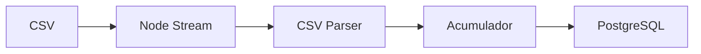

# Análise de Ingestão de CSV

> Diagnóstico e otimização do processo de carga de dados (ETL).

## Índice
- [1. Visão Geral do Fluxo](#1-visão-geral-do-fluxo)
- [2. Gargalos Identificados](#2-gargalos-identificados)
- [3. Otimizações Implementadas](#3-otimizações-implementadas)

---

## 1. Visão Geral do Fluxo

O sistema recebe dados da Secretaria de Educação via arquivos CSV.
**Ferramentas:** `csv-parser` (Node.js) + Prisma `createMany` (Batch Insert).



---

## 2. Gargalos Identificados

### Inserção Linha-a-Linha
Inserir registros um a um (`prisma.create`) é extremamente lento devido à latência de rede e overhead de transação.

### Uso de Memória
Carregar o arquivo CSV inteiro na memória (ex: `fs.readFileSync`) causaria crash em arquivos grandes (>500MB). O uso de **Streams** resolve isso.

---

## 3. Otimizações Implementadas

### Batch Insert (Lotes)
Agrupamos registros em arrays de 1.000 itens antes de enviar ao banco.
**Ganho:** Redução de ~80% no tempo de importação.

```javascript
// Exemplo de lógica
if (batch.length >= 1000) {
  await prisma.model.createMany({ data: batch });
  batch = [];
}
```

### Validação em Stream
A validação de dados (datas, campos obrigatórios) ocorre durante a leitura do stream, sem bloquear o processo principal.
