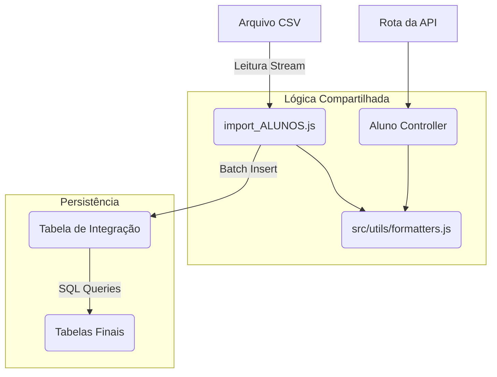

# Arquitetura de ETL (Extração, Transformação e Carga)

**Data da Última Atualização:** Dezembro 2025

Este documento descreve o processo de importação de dados no sistema SEDUC ON, que segue a arquitetura **MSC (Model-Service-Controller)** para garantir reutilização de código e manutenção simplificada.

## 🏗 Visão Geral

O processo de ETL não é isolado; ele é parte integrante do sistema, compartilhando utilitários e lógica com a API.



## 📂 Estrutura de Arquivos

*   **Orquestrador:** `backend/prisma/import_ALUNOS.js`
    *   Script principal que lê o arquivo, chama os validadores e insere no banco.
*   **Utilitários (Transform):** `backend/src/utils/formatters.js`
    *   Contém funções puras como `sanitizarTexto`, `converterData`, `converterIntSeguro`.
    *   **Importante:** Estas funções são usadas tanto pelo script quanto pela API para garantir consistência.
*   **Queries (Load):** `backend/src/etl/queries/distribution.queries.js`
    *   Armazena comandos SQL complexos e massivos para distribuir dados da tabela temporária para as tabelas finais.

## 🔄 Fluxo de Execução

1.  **Extract (Extração):**
    *   Leitura do arquivo CSV usando *streams* (pipe) para suportar arquivos gigantes sem estourar a memória.
2.  **Transform (Transformação):**
    *   Cada linha passa pelo `sanitizarTexto` para limpeza de espaços.
    *   Conversão de tipos (datas, inteiros) usando utilitários seguros.
    *   Validação de erros (campos obrigatórios vazios, datas inválidas).
    *   Registros inválidos são separados para a tabela `inconsistencias_importacao`.
3.  **Load (Carga):**
    *   Inserção em lote (Batch Insert) na tabela `alunos_integracao_all`.
    *   Execução das queries de distribuição para povoar `alunos_regular_ei_ef9`, `alunos_aee` e `alunos_eja`.

## 🛠 Como Executar

```bash
node backend/prisma/import_ALUNOS.js
```
