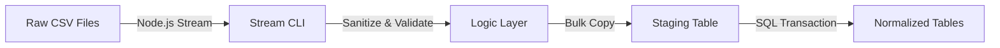

# Data Engineering & ETL Pipelines

**Classificação:** Data Architecture
**Pattern:** Extract-Transform-Load (ETL)
**Estratégia:** Stream Processing & Bulk Loading

Este documento detalha a engenharia de dados responsável pela ingestão e processamento de grandes volumes de dados legados (CSV) no ecossistema SEDUC ON.

## 1. Pipeline Architecture

O pipeline foi desenhado para maximizar o throughput de escrita e garantir a integridade referencial final, utilizando uma arquitetura de **Staging Buffer**.



### 1.1 Camada de Extração (Extraction Layer)
*   **Tecnologia:** Node.js Streams (`fs.createReadStream` + `csv-parser`).
*   **Justificativa:** O processamento via Stream permite a leitura de arquivos arbitrariamente grandes (GBs) com consumo de memória constante (`O(1)`), evitando *Heap Out of Memory*.

### 1.2 Camada de Transformação (Transformation Layer)
*   **Localização:** `src/utils/formatters.js`
*   **Lógica Compartilhada:** As funções de sanitização (`sanitizarTexto`, `parseDate`) são isomorfas, utilizadas tanto pelo ETL quanto pela API REST para garantir consistência de dados.
*   **Validação:** Registros que violam regras de negócio são desviados para `inconsistencias_importacao` (Dead Letter Queue concept).

### 1.3 Camada de Carga (Load Layer)
*   **Estratégia:** Two-Phase Commit simplificado.
    1.  **Staging Load:** Inserção rápida em tabelas sem constraints (`alunos_integracao_all`).
    2.  **Distribution:** Queries SQL massivas (`INSERT INTO ... SELECT`) movem os dados para as tabelas de domínio (`alunos_regular`, `alunos_aee`), aplicando normalização final.

## 2. Componentes do Subsistema

| Componente | Path | Função Técnica |
| :--- | :--- | :--- |
| **Orchestrator** | `backend/prisma/import_ALUNOS.js` | Entrypoint CLI para execução do pipeline. |
| **Logic Unit** | `src/utils/formatters.js` | Pure Functions para limpeza de strings e tipos. |
| **SQL Queries** | `src/etl/queries/*` | Raw SQL otimizado para distribuição de dados. |

## 3. Operational Guide

### Execução Manual do Pipeline
O ETL é invocado via CLI Node.js. Certifique-se de que o arquivo alvo existe no diretório `/csv`.

```bash
# Execução Padrão
node backend/prisma/import_ALUNOS.js

# Flags Opcionais (Futuro)
# --dry-run: Simula validação sem escrita
# --verbose: Logs detalhados de cada chunk
```

### Monitoramento
O sucesso da operação é indicado pelo exit code `0`. Falhas críticas retornam `1`.
Erros de linha (Row Level Errors) **não** abortam o processo, mas incrementam o contador de inconsistências.
