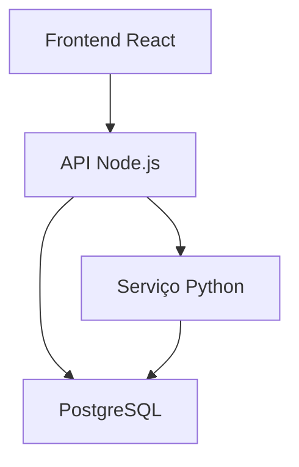

# Avaliação de Backend Híbrido (Node.js + Python) - SEDUC ON

**Status:** ⚠️ **Solução de Última Opção**  
**Data:** _A ser preenchido_

---

## 📋 Objetivo

Avaliar se há necessidade técnica de separar o backend em dois serviços (Node.js para API + Python para processamento de dados), ou se a arquitetura atual Node.js + PostgreSQL é suficiente.

---

## ⚠️ Princípio Central

> **Esta é a ÚLTIMA opção a considerar. Só devemos dividir o backend se for tecnicamente impossível manter a arquitetura atual.**

**Por quê evitar:**
- Aumenta complexidade de deploy
- Dificulta manutenção para equipe pequena (2 devs)
- Requer sincronização entre serviços
- Mais pontos de falha
- Stack de tecnologias duplicada

---

## 1. Contexto Atual

### 1.1 O que o Backend Faz Atualmente

| Funcionalidade | Tecnologia | Performance |
|----------------|------------|-------------|
| API REST | Node.js + Express | _A avaliar_ |
| Queries de leitura | Prisma + PostgreSQL | _A avaliar_ |
| Agregações estatísticas | PostgreSQL (GROUP BY, COUNT) | _A avaliar_ |
| Importação CSV | Node.js (csv-parser) | _A avaliar_ |
| Cálculos complexos | _Nenhum no momento?_ | N/A |

### 1.2 Questão Central

> **Existe algum processamento que Node.js + PostgreSQL NÃO consegue fazer de forma eficiente?**

---

## 2. Casos de Uso Para Backend Híbrido

### 2.1 Quando Python Seria Justificável

**Cenários típicos:**
- 📊 Análises estatísticas complexas (regressão, ML)
- 🧮 Processamento de dados massivo (milhões de linhas)
- 📈 Geração de relatórios com cálculos pesados
- 🤖 Machine Learning / IA
- 📉 Análise preditiva

### 2.2 O que o Sistema SEDUC ON Realmente Precisa?

**Funcionalidades atuais:**
- ✅ Agregações simples (COUNT, GROUP BY) - **PostgreSQL faz bem**
- ✅ Listagens e filtros - **PostgreSQL faz bem**
- ✅ Importação CSV - **Node.js faz bem**
- ❓ Análises estatísticas complexas? - **A avaliar**
- ❓ Cálculos personalizados? - **A avaliar**

**Análise do código atual:**

```bash
# Procurar por cálculos complexos no código
grep -r "Math\." /home/sant/seduc_on/backend/src
grep -r "statistic" /home/sant/seduc_on/backend/src
```

**Resultados:** _A preencher_

---

## 3. Teste Comparativo (Se Necessário)

### 3.1 Cenário de Teste

**Exemplo: Calcular média móvel de frequência**

```javascript
// Node.js + PostgreSQL
const stats = await prisma.$queryRaw`
  SELECT 
    aluno_id,
    AVG(frequencia) OVER (
      PARTITION BY aluno_id 
      ORDER BY data 
      ROWS BETWEEN 6 PRECEDING AND CURRENT ROW
    ) as media_movel_7dias
  FROM frequencias;
`;
```

vs

```python
# Python + pandas
import pandas as pd

df = pd.read_sql("SELECT * FROM frequencias", conn)
df['media_movel_7dias'] = df.groupby('aluno_id')['frequencia'].rolling(7).mean()
```

**Tempo de execução:**
| Tecnologia | Tempo (ms) | Complexidade |
|------------|------------|--------------|
| PostgreSQL | _TBD_ | Baixa (SQL nativo) |
| Node.js + cálculo manual | _TBD_ | Média |
| Python + pandas | _TBD_ | Baixa (pandas) |

### 3.2 Outros Cenários a Testar

1. **Agregação multi-nível**
2. **Cálculos percentuais**
3. **Indicadores educacionais**

---

## 4. Arquitetura Híbrida Proposta (Se Necessário)

### 4.1 Estrutura



### 4.2 Comunicação Entre Serviços

**Opção 1: HTTP/REST**
```javascript
// Node.js chama Python via HTTP
const result = await fetch('http://localhost:5000/calcular-indicadores', {
  method: 'POST',
  body: JSON.stringify({ escola_id: 123 })
});
```

**Opção 2: Message Queue (RabbitMQ/Redis)**
```javascript
// Node.js envia job
await queue.add('calcular-indicadores', { escola_id: 123 });

// Python worker processa
```

**Opção 3: Shared Database**
- Node.js escreve dados
- Python lê e processa
- Python escreve resultados
- Node.js lê resultados

### 4.3 Complexidade Adicional

**O que precisaríamos gerenciar:**
- [ ] Dois servidores rodando simultaneamente
- [ ] Deploy de duas aplicações
- [ ] Sincronização de dados
- [ ] Tratamento de erros entre serviços
- [ ] Monitoramento de dois sistemas
- [ ] Versionamento de API entre serviços

---

## 5. Alternativas Antes de Separar Backend

### 5.1 Otimizar PostgreSQL

**PostgreSQL é extremamente poderoso:**

```sql
-- Window functions
-- CTEs (Common Table Expressions)
-- Agregações complexas
-- Funções customizadas (PL/pgSQL)
```

**Exemplo: Função PostgreSQL para cálculo customizado**
```sql
CREATE OR REPLACE FUNCTION calcular_indicador_escola(escola_id INT)
RETURNS TABLE(
  indicador VARCHAR,
  valor NUMERIC
) AS $$
BEGIN
  RETURN QUERY
  SELECT 
    'Taxa de Aprovação' as indicador,
    (COUNT(*) FILTER (WHERE situacao = 'APROVADO')::NUMERIC / COUNT(*)) * 100 as valor
  FROM alunos
  WHERE cod_escola = escola_id;
END;
$$ LANGUAGE plpgsql;
```

### 5.2 Usar Node.js para Cálculos

**Node.js é rápido para cálculos numéricos:**

```javascript
// Exemplo: Cálculos estatísticos em Node.js
function calcularDesvigPadrao(valores) {
  const media = valores.reduce((a, b) => a + b) / valores.length;
  const variancia = valores.reduce((acc, val) => {
    return acc + Math.pow(val - media, 2);
  }, 0) / valores.length;
  return Math.sqrt(variancia);
}
```

**Bibliotecas JavaScript para estatística:**
- `simple-statistics`
- `mathjs`
- `stdlib`

### 5.3 Processamento Assíncrono (Node.js)

**Se cálculos são demorados:**

```javascript
// Usar worker threads
import { Worker } from 'worker_threads';

const worker = new Worker('./calcular-indicadores.js', {
  workerData: { escola_id: 123 }
});

worker.on('message', (result) => {
  console.log('Cálculo concluído:', result);
});
```

---

## 6. Análise Custo vs Benefício

### 6.1 Custos de Backend Híbrido

| Custo | Impacto |
|-------|---------|
| **Infraestrutura** | 2 serviços para deploy |
| **Complexidade** | Sincronização entre Node e Python |
| **Manutenção** | Equipe precisa dominar 2 linguagens |
| **Debug** | Erros podem estar em qualquer serviço |
| **Deploy** | Processo mais complexo |
| **Monitoramento** | 2 sistemas para monitorar |

### 6.2 Benefícios (Se Aplicável)

| Benefício | Quando Aplicável |
|-----------|------------------|
| **Performance** | Se Python for 10x mais rápido |
| **Bibliotecas** | Se precisar pandas, numpy, scikit-learn |
| **Especialização** | Se houver equipe Python disponível |

---

## 7. Decisão e Recomendação

### 7.1 Critérios de Decisão

**Separar backend APENAS se:**

- [ ] PostgreSQL não consegue executar cálculos em tempo aceitável
- [ ] Node.js não consegue processar dados eficientemente
- [ ] Há necessidade real de bibliotecas Python (ML, análise preditiva)
- [ ] O ganho de performance justifica a complexidade adicional

**Manter backend unificado se:**

- [x] PostgreSQL + Node.js atendem os requisitos atuais
- [x] Performance é aceitável
- [x] Equipe é pequena (2 desenvolvedores)
- [x] Não há uso de Machine Learning ou análise preditiva

### 7.2 Recomendação Final

> [!NOTE]
> **Recomendação:** _A preencher após análise_
>
> **Justificativa:**
> - _Baseado em necessidades reais do sistema_
> - _Considerando tamanho da equipe_
> - _Performance atual vs necessária_

---

## 8. Plano Alternativo (Arquitetura Unificada Otimizada)

### Opção Recomendada: Manter Node.js + PostgreSQL

**Otimizações a implementar:**

1. **Índices PostgreSQL** (seção 1 da análise)
2. **Queries otimizadas** (CTEs, window functions)
3. **Cache em memória ou Redis** (se necessário)
4. **Funções PostgreSQL** para cálculos complexos
5. **Worker threads Node.js** para processamento pesado

**Stack final recomendada:**
```
Frontend (React)
    ↓
API (Node.js + Express + Prisma)
    ↓
PostgreSQL (com funções PL/pgSQL)
    ↓
Cache (opcional: Redis ou em memória)
```

---

## 9. Se a Separação for Inevitável

### 9.1 Implementação Mínima

**Arquitetura micro-serviço leve:**

```
seduc_on/
├── api-node/          # API principal
│   ├── src/
│   └── package.json
├── worker-python/     # Worker para cálculos
│   ├── main.py
│   └── requirements.txt
└── docker-compose.yml # Orquestração
```

### 9.2 Comunicação Simples

**Usar shared database como ponto de integração:**

1. Node.js insere job na tabela `processing_queue`
2. Python worker lê queue e processa
3. Python escreve resultado em tabela `results`
4. Node.js lê resultados quando prontos

**Vantagem:** Sem HTTP entre serviços, apenas database

---

## 10. Conclusão

### Perguntas a Responder

1. **Há cálculos que PostgreSQL não executa bem?** _Sim/Não_
2. **Node.js está tendo problemas de performance?** _Sim/Não_
3. **Precisamos de bibliotecas Python específicas?** _Sim/Não_
4. **O ganho justifica a complexidade?** _Sim/Não_

### Próximos Passos

**Se análise indicar manter unificado:**
1. Implementar otimizações PostgreSQL
2. Adicionar índices necessários
3. Refatorar queries pesadas

**Se análise indicar separação:**
1. Criar POC com arquitetura híbrida
2. Medir ganho real de performance
3. Avaliar impacto na equipe
4. Decidir com usuário se vale a pena

---

## Referências

- [PostgreSQL Window Functions](https://www.postgresql.org/docs/current/tutorial-window.html)
- [Node.js Worker Threads](https://nodejs.org/api/worker_threads.html)
- [Pandas vs PostgreSQL Performance](https://medium.com/@tiagogsilva/pandas-vs-postgresql-performance-comparison-9e0e3c3e7e0f)
